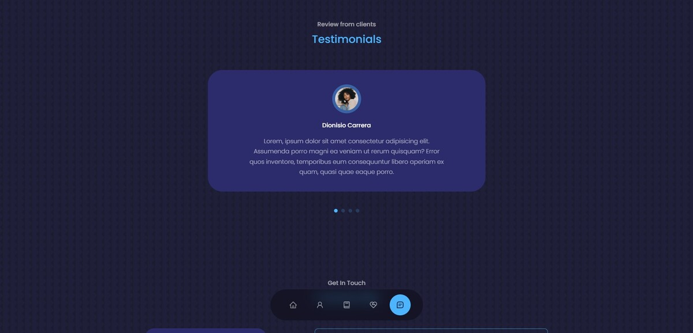

# Portafolio personal para un desarrollador fullstack developer

Este proyecto es un diseño para un portafolio personal de un desarrollador fullstack developer creado con React, Vite y TypeScript. Es una página web responsiva en inglés que muestra las sesiones de “Acerca de mi”, “Mi experiencia”, “Los servicios”, “Los portafolios de los proyectos”, “Testimonio” y “Contáctame”. Además, se puede descargar el CV y muestra las redes sociales. También se utiliza el servicio de EmailJS para enviar correos desde la página web.

## Tecnologías principales
-  React  
-  Vite  
-  TypeScript  
-  Netlify  

## Capturas de pantalla
Se deben agregar las capturas de pantalla para mostrar cómo se ve la página en desktop y móvil.

## Créditos
El proyecto fue creado a partir de un video tutorial de YouTube del canal "EGATOR". El link del video es https://www.youtube.com/watch?v=G-Cr00UYokU.

## Comparación de las tecnologías y características utilizadas
En comparación con el proyecto creado en el video tutorial, este proyecto utiliza TypeScript y Vite en lugar de JavaScript y “create-react-app”.

## Link
Puedes visitar la página web del proyecto en el siguiente enlace: [URL del sitio](https://1-porfolio-yha.netlify.app/)
